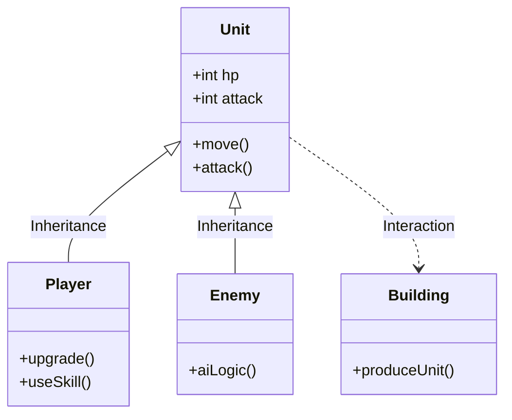

# ⚔️ War Times (Real-Time Strategy Game)


> **"전략과 컨트롤로 승리하라."**
> <br/>Java Swing과 소켓 통신을 활용하여 실시간 유닛 전투와 멀티플레이를 구현한 RTS(Real-Time Strategy) 게임

<br/>

## 📸 프로젝트 시연 (Demo)


<br/>


## 🛠 시스템 구조 (Class Architecture)

**객체지향 설계(OOP)**를 통해 유닛과 건물의 공통 속성을 효율적으로 관리했습니다.


<br/>

## 📌 주요 기능 (Key Features)

* **🏰 기지 건설 및 자원 채취 (Base Management)**
    * 본진(Base), 병영(Barracks), 금광(Gold Mine)을 건설하여 자원을 확보하고 유닛 생산 기반 마련
* **⚔️ 유닛 전투 및 진화 시스템 (Combat & Evolution)**
    * **자동 전투:** 적군과의 거리를 계산하여 사거리 내 진입 시 자동 공격
    * **유닛 진화:** 기본 유닛(Evo 0)에서 능력치가 강화된 상위 유닛(Evo 1)으로 진화 가능
* **⚡ 전략 스킬 시스템 (Active Skills)**
    * **Attack Boost:** 아군 유닛의 공격력을 일시적으로 증가
    * **Heal Tower:** 손상된 아군 타워 및 건물의 체력 회복
    * **Mass Slow:** 적군 유닛의 이동 속도를 감소시켜 전황 제어
* **🌐 실시간 멀티플레이 (Multiplayer)**
    * **Socket 통신:** Java ServerSocket을 활용하여 1:1 매칭 및 실시간 채팅 기능 구현

<br/>

## ⚡ 기술적 도전 및 해결 (Troubleshooting)

### 1. 화면 깜빡임 현상 해결 (Double Buffering)
* **Issue:** 다수의 유닛과 건물을 `paint()` 메서드로 실시간 렌더링할 때, 화면이 계속 지워졌다 그려지면서 심한 깜빡임(Flickering) 발생
* **Solution:** **더블 버퍼링(Double Buffering)** 기법 도입. 메모리상의 가상 이미지(`Off-screen Image`)에 모든 그래픽을 먼저 그린 후, 완성된 프레임을 화면에 한 번에 출력하여 깜빡임 제거

```java
// 더블 버퍼링 구현 예시 (개념 코드)
public void paint(Graphics g) {
    if (bufferImage == null) {
        bufferImage = createImage(w, h);
        bufferGraphics = bufferImage.getGraphics();
    }
    // 1. 가상 버퍼에 먼저 그리기
    renderGame(bufferGraphics); 
    
    // 2. 완성된 이미지를 실제 화면에 출력
    g.drawImage(bufferImage, 0, 0, this);
}
```
### 2. 소켓 통신 동기화 (Multi-Threading)
* **Issue:** 게임 상태 동기화와 채팅 메시지 전송이 동시에 이루어져야 해서 메인 스레드만으로는 처리 불가
* **Solution:** 서버와 클라이언트 간의 데이터 송수신을 담당하는 별도의 **스레드(Thread)**를 생성하여 게임 로직과 통신 로직을 병렬 처리

<br/>

## ⚙️ 기술 스택 (Tech Stack)

| Category | Technology |
|---|---|
| **Language** | Java (JDK 8+) |
| **GUI Library** | Java Swing, AWT |
| **Network** | Java Socket (TCP/IP) |
| **Tools** | Eclipse, WindowBuilder |
